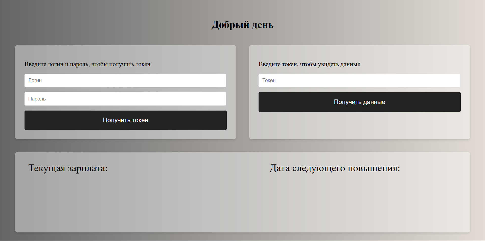

## Русский
### Запуск с помощью Docker

1. Соберите и запустите контейнер из директории проекта.
   Сделать это можно с помощью команды в терминале:
   `docker compose up -d`
2. Перейдите по адресу http://127.0.0.1:8000. Будет открыта следующая страница (внешний вид может отличаться в зависимости от монитора):
   
3. Введите одну из следующих комбинаций логина и пароля:

| Пароль | Логин |
|:------:|:-----:|
|  000   |  111  |
|  111   |  222  |
|  222   |  333  |
4. Нажмите "Получить токен". Новый токен автоматически скопируется в ваш буфер обмена и появится в окне для ввода.
5. Нажмите "Получить данные".
#### Редактирование базы данных. pgAdmin
По умолчанию в базе данных зарегистрированы 4 пользователя. Доступ к базе данных возможен лишь изнутри контейнера, поэтому для её редактирования можно воспользоваться установленным по умолчанию pgAdmin 4, порт которого — 5050.
### Запуск без контейнеризации
> Проект можно использовать с разными базами данных, однако их подключение к приложению будет отличаться. 
> Дальнейшая инструкция представлена для PostgreSQL и pgAdmin 4.
1. Установите PostgreSQL и pgAdmin. В проекте установите все пакеты с помощью poetry.
2. В pgAdmin создайте новую базу данных, которую будете использовать дальше.
3. В проекте отредактируйте файл backend.async_database.py:
   в строке
   `postgresql+asyncpg://postgres:postgres@pg:5432/employee`
   вместо первого "postgres" вставьте имя пользователя, используемого для вашей БД;
   вместо второго "postgres" — пароль;
   вместо "pg:5432" — хост БД;
   вместо "employee" — имя БД.
   И migrations.env.py:
   в строках
	`section = config.config_ini_section  
	`config.set_section_option(section, "DB_USER", "postgres") ` 
	`config.set_section_option(section, "DB_PASS", "postgres")  
	`config.set_section_option(section, "DB_NAME", "employee")  
	`config.set_section_option(section, "DB_HOST", "pg")  
	`config.set_section_option(section, "DB_PORT", "5432")`
   вставьте свои значения.
4. Выполните 
   `alembic upgrade head`
5. Создайте несколько пользователей.
6. Запустите файл run.py.
7. Перейдите по адресу http://127.0.0.1:8000. Будет открыта следующая страница (внешний вид может отличаться в зависимости от монитора):
   
8. Введите данные одного из созданных вами пользователей.
9. Нажмите "Получить токен". Новый токен автоматически скопируется в ваш буфер обмена и появится в окне для ввода.
10. Нажмите "Получить данные".
## English
### Running with Docker

1. Build and launch the container from the project directory.  
   You can do this using the terminal command:  
   `docker compose up -d`
2. Go to [http://127.0.0.1:8000](http://127.0.0.1:8000). The following page will open (the appearance may vary depending on your monitor):  
   
3. Enter one of the following login and password combinations:

| Password | Login |
|:--------:|:-----:|
|   000    |  111  |
|   111    |  222  |
|   222    |  333  |

4. Click **Get Token**. The new token will automatically be copied to your clipboard and will appear in the input window.
5. Click **Get Data**.

#### Editing the Database – pgAdmin

By default, 4 users are registered in the database.  
Access to the database is only possible from inside the container, so to edit it, you can use the preinstalled pgAdmin 4, which is available on port **5050**.

---

### Running without Containerization

> **Note**  
> The project can be used with different databases; however, their connection to the application will differ.  
> The following instructions are provided for PostgreSQL and pgAdmin 4.

1. Install PostgreSQL and pgAdmin.  
   In the project, install all packages using Poetry.
2. In pgAdmin, create a new database that you will use further.
3. In the project, edit the file `backend.async_database.py`:  
   In the line:  
   ```
   postgresql+asyncpg://postgres:postgres@pg:5432/employee
   ```
   - replace the first `postgres` with your database username;
   - replace the second `postgres` with your password;
   - replace `pg:5432` with your database host;
   - replace `employee` with your database name.

   Also, in `migrations.env.py`, in the lines:
   ```python
   section = config.config_ini_section
   config.set_section_option(section, "DB_USER", "postgres")
   config.set_section_option(section, "DB_PASS", "postgres")
   config.set_section_option(section, "DB_NAME", "employee")
   config.set_section_option(section, "DB_HOST", "pg")
   config.set_section_option(section, "DB_PORT", "5432")
   ```
   insert your values accordingly.
4. Run:
   ```
   alembic upgrade head
   ```
5. Create several users.
6. Run the file `run.py`.
7. Go to [http://127.0.0.1:8000](http://127.0.0.1:8000). The following page will open (the appearance may vary depending on your monitor):  
   
8. Enter the credentials of one of the users you created.
9. Click **Get Token**. The new token will automatically be copied to your clipboard and will appear in the input window.
10. Click **Get Data**.
